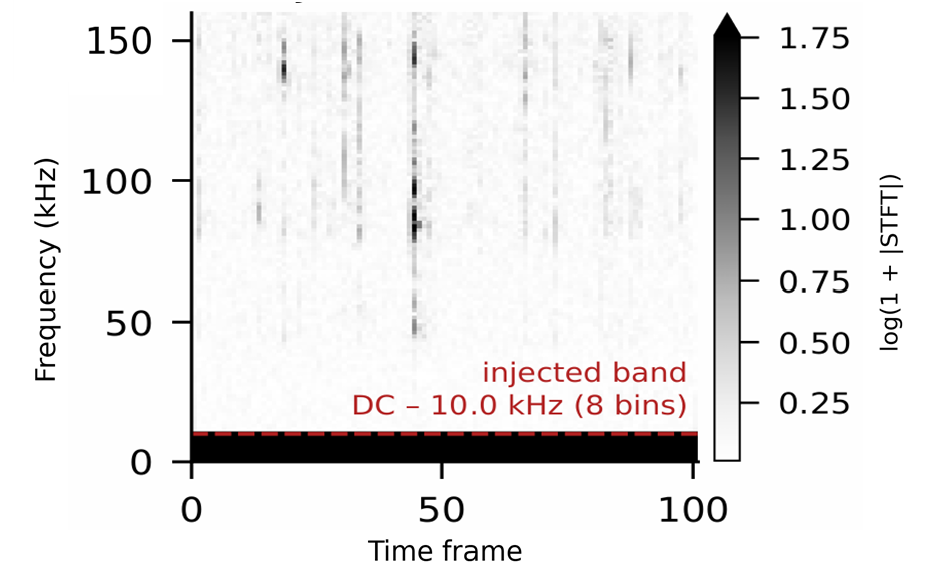
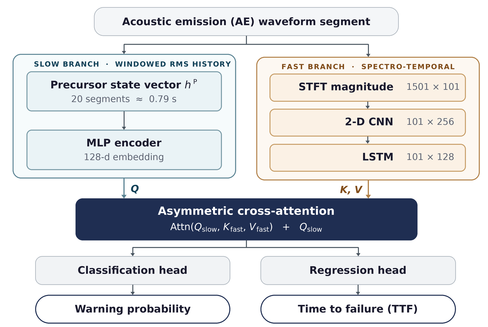
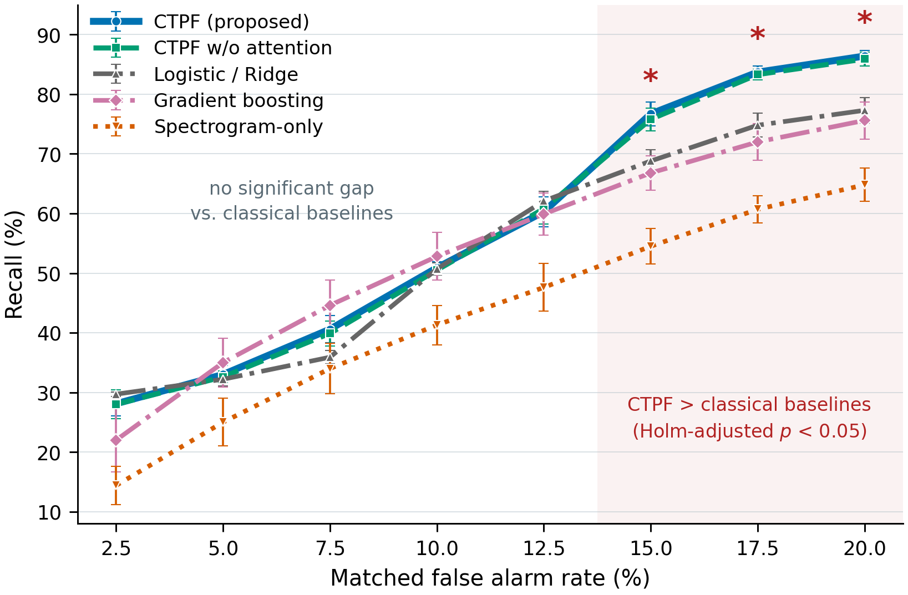
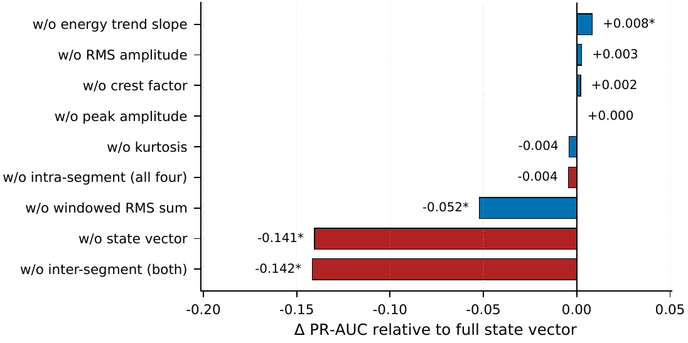
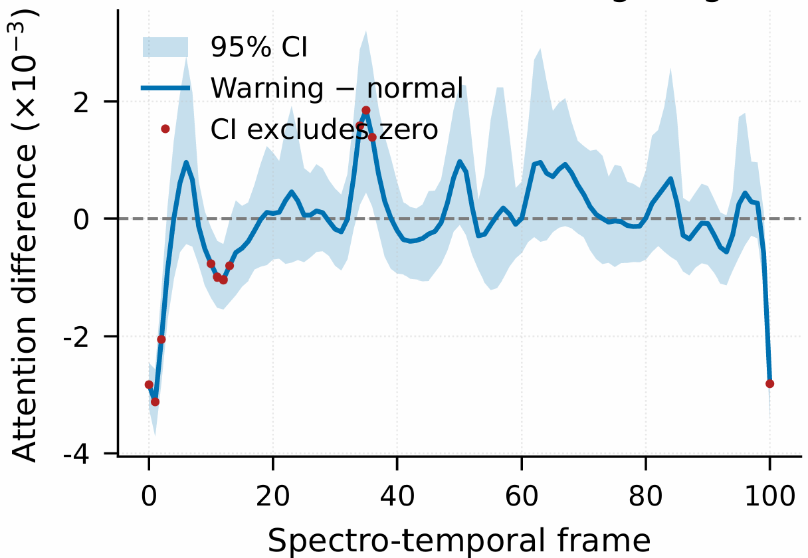
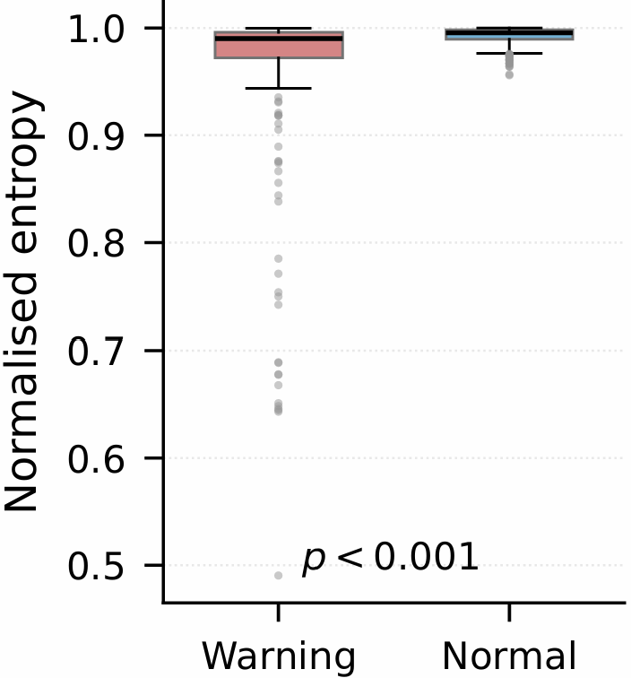
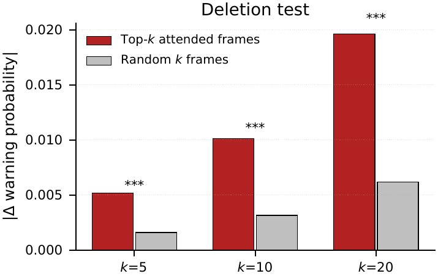

## 🔗 🥇 ASK2026 : Rockburst Early Warning Using Windowed RMS History and Acoustic Emission Signals

주제 : RMS 이동 이력과 음향 방출 신호를 활용한 Rockburst 조기경보 모델

* **저자 : 정지성, 설재훈, 김가빈, 이규원, 오준석, 김영균**
* **ACK 2026 한국정보처리학회 학술대회논문집 33권 2호 ooo-ooo(0pages)**

[](https://www.python.org/downloads/)
[](https://pytorch.org/)
[](https://www.kaggle.com/c/LANL-Earthquake-Prediction)
[](https://opensource.org/licenses/MIT)

개요: 본 연구는 심부 지하 굴착 현장의 Rockburst 재해에 대한 실시간 조기경보를 위해, 개별 구간의 스펙트로그램(빠른 시간척도)과 직전 20개 구간의 RMS 이동 이력(느린 시간척도)을 각각 인코딩한 뒤 비대칭 교차 어텐션으로 융합하는 조기경보 모델 **CTPF(Cross-Timescale Precursor state Fusion)**를 제안하였다. 제거 실험을 통해 성능 향상의 원인이 결합 구조의 정교함이 아니라 구간 경계를 넘는 누적 이력 정보 자체에 있음을 정량적으로 규명하였다.

---

## 📝 01. 요약 (Abstract)

> 심부 지하 개발 확대로 Rockburst 재해 위험이 커지며 실시간 조기경보 기술의 중요성이 증가하고 있다. 기존 연구는 개별 구간 특성 중심으로 위험을 판별해 파괴 이전 누적 이력을 충분히 반영하지 못한다. 이에 본 연구는 개별 구간 정보와 직전 20개 구간의 RMS 이동 이력을 서로 다른 시간척도로 처리해 결합하는 조기경보 모델 CTPF를 제안하였다. 제안 모델은 스펙트로그램 단독 모델보다 경보 성능이 향상되었으며, 제거 실험으로 성능 향상의 주된 원인이 구간 간 누적 이력 정보임을 확인하였다.

---

## 📌 02. 연구 배경 및 문제 정의 (Background & Research Question)

지상 공간 포화와 자원 고갈로 고토피압 환경의 굴착이 늘면서 탄성 변형 에너지가 급격히 방출되는 Rockburst 위험이 증가하고 있으며, 파괴는 순간적으로 발생해 사후 복구가 불가능하므로 파괴 이전에 내려지는 경보가 사실상 유일한 대응 수단이다.

* **한계:** 기존 연구는 신호를 일정 길이 구간으로 나누고 각 구간의 특성만으로 위험을 판별해 왔으며, 다중 정보를 결합한 접근 역시 결합된 정보가 실제로 상호 보완적인지 분리 검증하지 않은 채 성능의 근거를 모델 복잡성에서 찾아왔다.
* **핵심 통찰:** 암반 파괴는 미세 균열이 누적되어 발생하므로, 순간의 신호가 동일해도 축적된 에너지 수준에 따라 파괴까지 남은 시간(TTF)은 달라진다. 구간 단위 관측만으로는 이 장기적 에너지 축적 양상을 반영하기 어렵다.
* **연구 질문:** 구간 경계를 넘는 이력은 스펙트로그램으로 대체할 수 없는 정보를 담고 있는가?
* **경보 라벨 정의:** 하나의 파괴 사이클을 잔여시간(TTF) 기준으로 정상(TTF > 3.0 s)과 경보(TTF ≤ 3.0 s)로 구분하며, 평균 파괴 사이클 10.7 ± 2.6 s 중 28.9%가 경보 구간에 해당한다.

---

## 📌 03. 데이터셋 구축 및 전처리 (Dataset)

LANL 실험실 stick–slip 마찰 실험의 음향 방출(AE) 데이터를 사용하였다. 연속파형을 4 MHz 샘플링 기준 150,000 샘플(공칭 37.5 ms / 실측 중앙값 39.30 ms) 단위로 분할하고, 3,000 샘플 창·50% 중첩 STFT로 1,501 × 101 스펙트로그램을 생성하였다. 사이클 경계·미완결 사이클을 제외해 총 **4,131개**의 유효 구간(완전 파괴 사이클 16개)을 확보하고, 파괴 사이클 단위로 학습:검증:평가 = **10:3:3**으로 시간순 분할하였다.

* 실험실 데이터의 낮은 배경 잡음을 보완하기 위해, 현장 회전 기계 잡음을 모사한 가우시안 잡음을 최저 8개 주파수 bin(DC–10.0 kHz, bin 폭 1.33 kHz)에 가산하였다. 단, 실측 TBM 스펙트럼이 아닌 가상 시나리오다.
* 파괴 사이클 경계는 파괴 직후 TTF가 급증하는 지점을 기준으로 검출하였다.

<p align="center">
  
</p>
<p align="center"><sub>그림 1. 잡음이 주입된 음향 방출 신호 스펙트로그램 — 저주파 8개 bin(DC–10.0 kHz)에 주입된 잡음 대역을 표시</sub></p>

---

## 📌 04. 전조 상태 벡터 및 모델 구조 (Precursor State Vector & CTPF Architecture)

STFT 스펙트로그램은 개별 구간의 시간–주파수 특성은 반영하지만 구간 간 이력은 담지 못한다. 이를 보완하기 위해 현재 구간에서만 계산되는 Intra 특징 4종과, 직전 20개 구간의 RMS 이력에서만 얻어지는 Inter 특징 2종으로 구성된 6차원 전조 상태 벡터를 설계하였다. Inter 특징은 현재 값을 이력에 반영하기 전에 계산하고 파괴 사이클마다 초기화한다.

**표 1. 전조 상태 벡터 구성**

| 구분 | 특징 | 설명 | 관측 창 |
|---|---|---|---|
| Intra | RMS amplitude | 방출 세기 (Emission level) | 39.30 ms |
| Intra | Kurtosis / Peak / Crest factor | 파형의 충격성 (Waveform impulsiveness) | 39.30 ms |
| Inter | RMS trend slope | 직전 RMS 이력의 기울기 | 0.786 s |
| Inter | Windowed RMS sum | 직전 RMS 이력의 이동합 (사이클 전체 누적이 아닌 직전 20구간의 이동합, 평균 사이클의 약 7%) | 0.786 s |

제안 모델 **CTPF**는 두 시간척도를 각각 인코딩한 뒤 융합한다. 빠른 척도 경로는 2-D CNN이 주파수 축만 축약해 시간 프레임 101개를 보존하고 LSTM이 프레임별 표현을 산출하며(→ 101 × 128), 느린 척도 경로는 MLP가 상태 벡터를 128차원 질의 표현(Query)으로 인코딩한다. 융합은 비대칭 교차 어텐션 `Attn(Q_slow, K_fast, V_fast)`으로 이루어지며, 어텐션을 거치지 않는 Q 잔차 연결을 함께 두어 두 경로의 정보를 모두 보존한다. 최종적으로 분류 헤드(경보 확률)와 회귀 헤드(잔여시간 TTF)를 동시에 산출하는 이중 과제 구조다.

<p align="center">
  
</p>
<p align="center"><sub>그림 2. 제안 모델(CTPF) 아키텍처 — 느린 척도(전조 상태 벡터) → Query, 빠른 척도(스펙트로그램) → Key/Value</sub></p>

---

## 📌 05. 손실 함수 및 평가 프로토콜 (Loss & Evaluation Protocol)

통합 손실 함수는 분류·회귀·에너지 가중 항을 결합한다.

* **분류 항:** Focal loss (γ = 2.0, class-balanced α) — 다수 클래스 편향 완화
* **회귀 항:** 잔여시간(TTF) 예측 오차 — 원시 TTF(0.006–16.103 s)는 학습 분할 최댓값으로 [0, 1] 정규화 후 초 단위로 역변환
* **에너지 가중 항:** RMS 진폭이 높은(방출이 활발한) 구간에 더 큰 비용 부과 (λ_p = 0.15)

**평가 원칙**

1. 파괴 사이클 단위 시간순 분할(10:3:3)로 평가를 "미관측 사이클로의 일반화"로 정의
2. 정규화 통계·운영 임계치를 학습·검증에서만 결정해 test에 불변 적용 (정보 유입 차단)
3. 목표 FAR 15%, 안전계수 κ = 0.6 → 검증에서 9%를 겨냥하는 임계치 t* = argmax Recall_val(t) s.t. FAR_val(t) ≤ κ·FAR_target
4. 15개 독립 시드 반복, 동일 시드 쌍 대응 t-검정 + Holm–Bonferroni 보정, 주 지표 PR-AUC
5. 모델별 운영점 차이를 제거하기 위해 8개 공통 FAR(2.5–20%)에서 재평가

미탐지는 회복 불가능한 비용, 오경보는 회복 가능한 비용이라는 전제를 반영한 설계다.

---

## 📌 06. 결과 ① 분류·회귀 성능 (Performance)

15개 독립 시드 평균 ± 표준편차 기준이며, 운영 임계치는 validation에서만 결정해 test에 불변 적용하였다(PR-AUC 기준선/경보 비율 0.276).

**표 2. 비교 모델별 분류·회귀 성능 비교**

| Model | Input | PR-AUC | Recall (%) | FAR (%) | RMSE (s) | R² |
|---|---|---|---|---|---|---|
| **CTPF (제안)** | Spec + State | **0.736 ± 0.006** | **80.98 ± 0.93** | 16.29 ± 0.55 | **2.627 ± 0.022** | **0.502** |
| CTPF w/o attention | Spec + State | 0.733 ± 0.005 | 80.26 ± 1.42 | 16.14 ± 0.49 | 2.637 ± 0.023 | 0.498 |
| Logistic / Ridge | State | 0.726 ± 0.004 | 75.96 ± 1.41 | 18.78 ± 0.53 | 2.884 ± 0.010 | 0.400 |
| Gradient boosting | State | 0.691 ± 0.028 | 61.93 ± 4.04 | 13.07 ± 1.25 | 2.915 ± 0.056 | 0.387 |
| Spectrogram-only | Spec | 0.588 ± 0.027 | 50.48 ± 4.55 | 13.63 ± 0.95 | 2.979 ± 0.059 | 0.360 |

스펙트로그램 단독 대비 PR-AUC **+25.3%**, 재현율 **+30.5%p**, RMSE **−0.352 s**로 향상되었으며, 24개 주요 비교 전부 Holm 보정 후 유의(p < 0.05)하였다. 다만 FAR은 낮을수록 좋은 지표이며 제안 모델의 FAR이 오히려 더 높아 "전 지표 우위"는 성립하지 않는다. 또한 상태 벡터 6차원만 쓰는 Logistic/Ridge(0.726)가 스펙트로그램 단독 딥러닝(0.588)을 크게 상회해, 판별력의 상당 부분이 저차원 상태 특징에 있음을 시사한다. 모델별 임계치가 만드는 운영점 차이를 제거하기 위해 다음 절에서 동일 FAR 재평가를 수행하였다.

---

## 📌 07. 결과 ② 동일 오경보율(FAR)에서의 재평가 (Matched-FAR Evaluation)

모든 모델을 8개 공통 FAR(2.5–20%)에서 재평가한 재현율이다.

* FAR 12.5% 이하에서는 고전 baseline과 유의차 없음 (단, 스펙트로그램 단독과의 차이는 전 구간에서 유의)
* FAR 12.5–15%를 기점으로 격차가 벌어지며, 목표 운영점 FAR 15%에서 CTPF 76.7% vs. Gradient Boosting 66.8%(−9.9%p) / Logistic·Ridge 68.8%(−7.9%p)로, 두 차이 모두 Holm 보정 후 유의
* FAR 20%에서도 GB 대비 +10.8%p, LR 대비 +9.1%p 격차 유지
* 어텐션 유무의 차이는 모든 FAR에서 유의하지 않음

저차원 상태 특징만으로는 낮은 오경보 조건에서의 판별에 그치지만, 스펙트로그램과의 결합은 일정 수준의 오경보를 허용하는 운영 영역에서 추가 재현율 향상을 제공한다. **위 값은 평가 곡선에서 읽은 상한이며 실제 배포 시 달성되는 성능이 아니다.** 실제 달성치는 6절의 Recall 80.98% / FAR 16.29%다.

<p align="center">
  
</p>
<p align="center"><sub>그림 3. 동일한 오경보율(FAR) 조건에서의 재현율 — 15개 독립 시드 평균 ± 표준편차</sub></p>

---

## 📌 08. 결과 ③ 정보 종류별 기여도 검증 (Ablation)

개별 특징 6종·특징군 2종·전체 상태 벡터 무력화 1종, 총 9개 설정으로 제거 실험을 수행하였다(8 시드). 제거는 0이 아닌 학습 분할 평균값으로 대체해 차원 수 변화의 효과를 배제하였다.

1. **원인은 차원 수가 아니라 정보의 종류다.** Inter 2종 제거 시 PR-AUC 0.735 → 0.593(−19.30%)로 스펙트로그램 단독 수준까지 하락하지만, Intra 4종을 전부 제거해도 −0.60%로 유의하지 않다.
2. **상태 벡터의 이득은 사실상 전부 Inter에서 온다.** Inter 제거(−0.142)와 상태 벡터 전체 무력화(−0.141)가 통계적으로 구분되지 않는다.
3. **두 Inter 특징은 대칭적이지 않다.** Windowed RMS sum 단독 제거(−0.052\*)가 실제 정보를 담고 있고 RMS trend slope 단독 제거(+0.008\*)는 잉여에 가깝지만, 동시 제거 시 −0.142로 개별 합(−0.044)의 약 3.2배다. 한쪽이 남으면 다른 쪽을 부분적으로 대체하는 초가법적 관계다.
4. **손실 함수·융합 방식은 유의한 차이를 만들지 않았다.** 융합 방식 차이 +0.003(15 시드, 8개 지표 전부 Holm p = 1.00), 손실 항 제거 4개 설정 전부 n.s.였으며, 파라미터를 13.4% 적게 쓰는(374,210 vs. 432,066) 단순 결합으로도 동등한 성능을 얻는다. 따라서 성능의 근거로 "물리 정보 기반"을 주장하지 않는다.

<p align="center">
  
</p>
<p align="center"><sub>그림 4. 상태 벡터 구성 요소 제거에 따른 PR-AUC 변화 (8 시드, * = Holm 보정 후 유의)</sub></p>

---

## 📌 09. 결과 ④ 판단 근거 해석 및 인과적 검증 (Attention as Evidence)

교차 어텐션은 성능을 올리지 않았다(8개 지표 전부 유의하지 않음, Holm p = 1.00). 그러나 조기경보는 최종적으로 사람이 대피를 결정하는 체계이므로, 근거 제시 가능성을 3단계로 검증하였다.

* **(a) 분포:** 경보 상태에서는 구간 양 끝의 비중이 줄고 내부로 이동하며, 일부 프레임에서 정상 상태와 유의하게 다르다.
* **(b) 집중도:** 경보 구간의 정규화 엔트로피가 평시보다 유의하게 낮다(p < 0.001). 다만 유효 프레임 수 기준으로는 여전히 101개의 절반 이상에 분포해, "집중된다"가 아니라 "유의하게 좁아지되 넓게 분포한다"가 정확한 서술이다.
* **(c) 삭제 실험(인과):** 상위 k개 어텐션 프레임을 마스킹했을 때의 경보 확률 변화가 무작위 마스킹 대비 약 3배이며, k = 5·10·20 전부에서 p < 0.001로, 가중치가 예측에 실제로 관여한다는 직접 증거다.

어텐션의 가치는 성능이 아니라 검증 가능한 판단 근거에 있으며, 동등 성능의 단순 결합 구조는 이러한 시간적 근거를 제시하지 못한다.

<p align="center">
  
  
</p>
<p align="center"><sub>그림 5(a)(b). (a) 프레임별 어텐션 가중치 차이(95% CI) — (b) 경보/평시 상태의 정규화 엔트로피 비교</sub></p>

<p align="center">
  
</p>
<p align="center"><sub>그림 5(c). 삭제 실험 — 상위 k개 어텐션 프레임 마스킹 대 무작위 k개 마스킹의 경보 확률 변화</sub></p>

---

## 📌 10. 실시간 처리 가능성 (Real-Time Latency)

구간의 실제 발생 주기(39.30 ms) 대비 5.33배의 여유를 확보하였다 (NVIDIA A100-SXM4-40GB 기준이며, 엣지 장비에서는 재측정이 필요하다).

| 처리 단계 | 지연시간 |
|---|---|
| STFT 전처리 | 3.347 ms |
| 전조 상태 벡터 계산 | 1.718 ms |
| 텐서 전송 | 0.398 ms |
| 모델 추론 | 1.907 ms |
| **합계 (원신호 취득 → 추론)** | **7.37 ms** |

---

## 📝 11. 결론 (Conclusion)

* **이력 정보의 기여를 실증했다.** 성능 향상의 약 90%가 스펙트로그램으로 대체 불가능한 직전 20구간의 RMS 이동 이력에서 비롯된다. 스펙트로그램 단독 베이스라인 대비 PR-AUC는 0.588 → 0.736, 재현율은 50.48% → 80.98%로 향상되었다.
* **향상의 원인은 결합 그 자체였다.** 융합 방식(교차 어텐션 대 단순 결합)의 차이는 유의하지 않으며, 파라미터를 13.4% 적게 쓰는 단순 결합으로도 동등한 성능을 얻는다.
* **판단 근거를 인과적으로 검증했다.** 삭제 실험에서 상위 어텐션 프레임의 기여가 무작위 대비 약 3배로 유의해, 가중치가 예측에 실제로 쓰인다는 직접 증거를 확보했다.
* **실시간 동작이 가능하다.** 전처리를 포함한 전체 지연 7.37 ms로 구간 발생 주기 39.30 ms 대비 5.33배의 여유를 확보했다.

본 연구는 Rockburst 조기경보에서 순간 음향 신호뿐 아니라 파괴 이전에 누적되는 이력 정보를 함께 고려하는 것이 중요함을 정량적으로 제시하였으며, 현장의 선제적 대피 의사결정을 지원해 심부 지하 굴착공사의 안전성 향상에 기여할 것으로 기대된다.

---

## 🔍 12. 한계 및 향후 연구 (Limitations & Future Work)

* 본 연구의 TTF는 실험실 규모 측정값으로 실제 현장의 파괴 진행 속도에 직접 대응하지 않으며, 3.0초 경보 임계값은 클래스 균형을 고려한 라벨링 기준일 뿐 현장에서 확보되는 대피 가능 시간을 뜻하지 않는다.
* **사이클 단위 편향의 보정** — 완전 파괴 사이클이 16개로 제한적이므로 사이클 수를 늘린 일반화 검증이 필요하다.
* **오경보 안전계수(κ)의 재보정** 및 현장 대피시간을 고려한 경보 임계값 최적화가 필요하다.
* **실측 현장 잡음 환경에서의 재평가** — 본 연구의 잡음 주입은 실측 TBM 스펙트럼이 아닌 가상 시나리오이므로, 실제 지하 굴착 환경에서의 검증이 필요하다.
* **범용성 확보** — 특정 지역·장비에 국한되지 않는 다양한 지질 조건에서의 범용 모델 개발.

---

## 📄 13. 참고문헌 (References)

* [1] Zhou, J., Li, X., Mitri, H. S., "Classification of Rockburst in Underground Projects: Comparison of Ten Supervised Learning Methods," *J. Comput. Civ. Eng.*, Vol. 30, No. 5, 04016003, 2016.
* [2] Rouet-Leduc, B., Hulbert, C., Lubbers, N., Barros, K., Humphreys, C. J., Johnson, P. A., "Machine Learning Predicts Laboratory Earthquakes," *Geophys. Res. Lett.*, Vol. 44, No. 18, pp. 9276–9282, 2017.
* [3] Lu, C.-P., Liu, G.-J., Liu, Y., Zhang, N., Xue, J.-H., Zhang, L., "Microseismic Multi-parameter Characteristics of Rockburst Hazard Induced by Hard Roof Fall and High Stress Concentration," *Int. J. Rock Mech. Min. Sci.*, Vol. 76, pp. 18–32, 2015.
* [4] Di, Y., Wang, E., "Rock Burst Precursor Electromagnetic Radiation Signal Recognition Method and Early Warning Application Based on Recurrent Neural Networks," *Rock Mech. Rock Eng.*, Vol. 54, No. 3, pp. 1449–1461, 2021.
* [5] Bolton, D. C., Shreedharan, S., Rivière, J., Marone, C., "Acoustic Energy Release During the Laboratory Seismic Cycle: Insights on Laboratory Earthquake Precursors and Prediction," *J. Geophys. Res. Solid Earth*, Vol. 125, No. 8, e2019JB018975, 2020.
* [6] Wu, N., Jastrzębski, S., Cho, K., Geras, K. J., "Characterizing and Overcoming the Greedy Nature of Learning in Multi-modal Deep Neural Networks," *ICML*, Baltimore, USA, 2022, pp. 24043–24055.
* [7] Grinsztajn, L., Oyallon, E., Varoquaux, G., "Why Do Tree-based Models Still Outperform Deep Learning on Tabular Data?," *NeurIPS*, New Orleans, USA, 2022, pp. 507–520.
* [8] Johnson, P. A., Rouet-Leduc, B., Pyrak-Nolte, L. J., et al., "Laboratory Earthquake Forecasting: A Machine Learning Competition," *Proc. Natl. Acad. Sci. U.S.A.*, Vol. 118, No. 5, e2011362118, 2021.
* [9] Wiegreffe, S., Pinter, Y., "Attention Is Not Not Explanation," *EMNLP-IJCNLP*, Hong Kong, China, 2019, pp. 11–20.
* [10] Lin, T.-Y., Goyal, P., Girshick, R., He, K., Dollár, P., "Focal Loss for Dense Object Detection," *ICCV*, Venice, Italy, 2017, pp. 2999–3007.

---

## 🧑‍💻 Citation

```bibtex
@article{jung2026rockburst,
  title={Rockburst Early Warning Using Windowed RMS History and Acoustic Emission Signals},
  author={Jisung Jung, Jaehoon Seol, Gabeen Kim, Gyuwon Lee, JunSeok Oh, Younggyun Kim},
  journal={Academic Research Project},
  year={2026}
}
```
